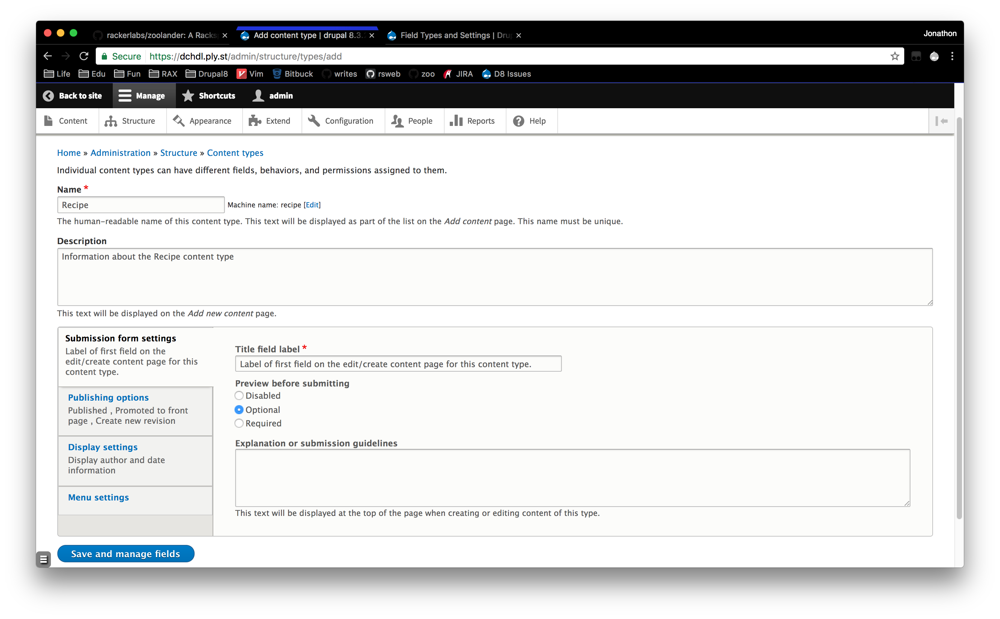

# Content Types

A Content Type is an entity sub-type of the content entity type Content Item and is defined by the Node Module.

Content types typically contain the main content of a page on a Drupal site.

## Content Entities

According to the Drupal [Concept: Content Entities and Fields](https://www.drupal.org/docs/user_guide/en/planning-data-types.html):

> A content entity (or more commonly, entity) is an item of content data, which can consist of text, HTML markup, images, attached files, and other data that is intended to be displayed to site visitors. Content entities can be defined by the core software or by modules.

> Content entities are grouped into entity types, which have different purposes and are displayed in very different ways on the site. Most entity types are also divided into entity sub-types, which are divisions within an entity type to allow for smaller variations in how the entities are used and displayed.

## Adding a Content Type
https://www.drupal.org/docs/user_guide/en/structure-content-type.html
1. Navigate to `Structure` -> `Content Types` (admin/structure/types). A list of the available Content Types will be shown.
2. Click `Add Content Type` to create a new Content Type.

## Field types
https://www.drupal.org/docs/7/api/field-api/field-types-and-settings

* [file (File)](http://api.drupal.org/api/drupal/modules%21file%21file.field.inc/function/file_field_info/7):
* [image (Image)](http://api.drupal.org/api/drupal/modules%21image%21image.field.inc/function/image_field_info/7):
* [taxonomy_term_reference (Term Reference)](http://api.drupal.org/api/drupal/modules%21taxonomy%21taxonomy.module/function/taxonomy_field_info/7):
* [List fields](http://api.drupal.org/api/drupal/modules%21field%21modules%21list%21list.module/function/list_field_info/7):
* [Number fields](http://api.drupal.org/api/drupal/modules%21field%21modules%21number%21number.module/function/number_field_info/7):
* [Text fields](http://api.drupal.org/api/drupal/modules%21field%21modules%21text%21text.module/function/text_field_info/7):

## Adding Fields to a Content Type
https://www.drupal.org/docs/user_guide/en/structure-fields.html
1. Navigate to `Structure` -> `Content Types` (admin/structure/types). A list of the available Content Types will be shown.
Then click Manage fields in the dropdown button for the Vendor content type. The Manage fields page appears.
Click Add field. The Add field page appears. You can either create a new field for the content type or re-use an existing field.

## Concept Reference Fields
https://www.drupal.org/docs/user_guide/en/structure-reference-fields.html

## Adding Reference Fields
https://www.drupal.org/docs/user_guide/en/structure-adding-reference.html
