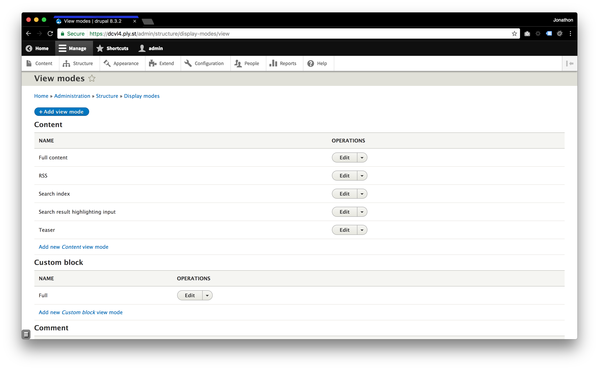
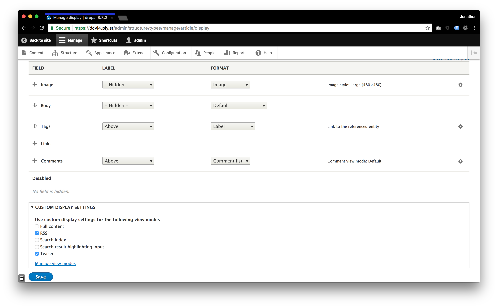
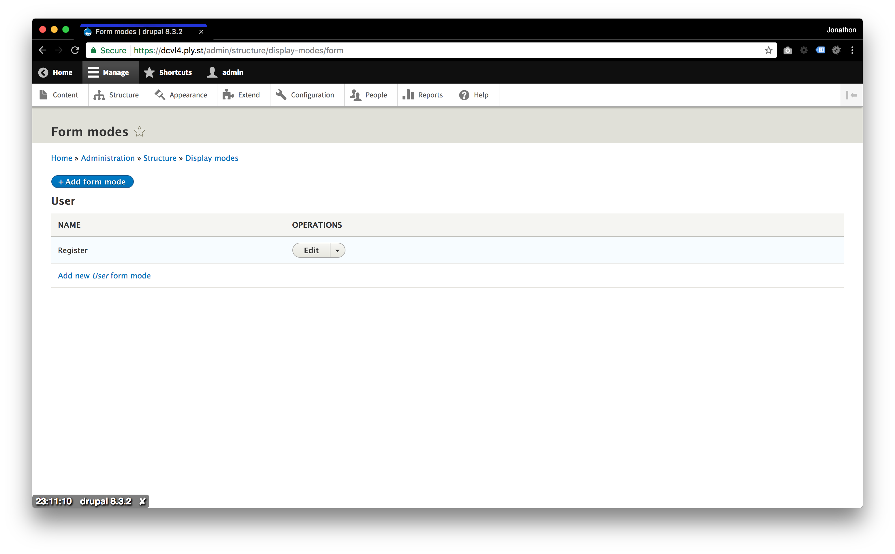

# Display Modes

According to [Drupal.org - Display Modes, View Modes, and Form Modes](https://www.drupal.org/docs/8/api/entity-api/display-modes-view-modes-and-form-modes):

> Display modes exist to provide different presentations of Content Entities for either viewing or editing. The two types of display modes are "view modes" and "form modes." Both of these display mode types—view modes and form modes—are examples of "[configuration entities](https://www.drupal.org/node/2143501)."

```
uuid: 15dc7aa9-13fd-4412-9c06-06d09f915d08
langcode: en
status: false
dependencies:
  module:
    - node
id: node.full
label: 'Full content'
targetEntityType: node
cache: true
```
> ```reference: core.entity_view_mode.node.full.yml```

> The main property to take note of is the "```targetEntityType```" property. Each display mode (view mode or form mode) is associated with one, and only one, type of Content Entity.

## View Modes
> View modes exist to allow Drupal site building tools like Entity Reference fields to request a given entity be rendered in a certain way.

To see the list of View Modes navigate to `Structure` -> `Display modes` -> `View modes`.



To update the available View Modes for a specific content type navigate to `Structure` -> `Content types` -> `Edit` -> `Manage display` -> `Custom Display Settings`.


## Form Modes
> Form modes allow for multiple sets of field widget orderings and customizations, just as view modes allow for different orderings and customization of field formatters.

> Unlike view modes (which fall back to the default view display if view display does not exist for a given view mode) form modes will not use the ‘default’ operation by default.

To see the list of Form Modes navigate to `Structure` -> `Display modes` -> `Form modes`.

