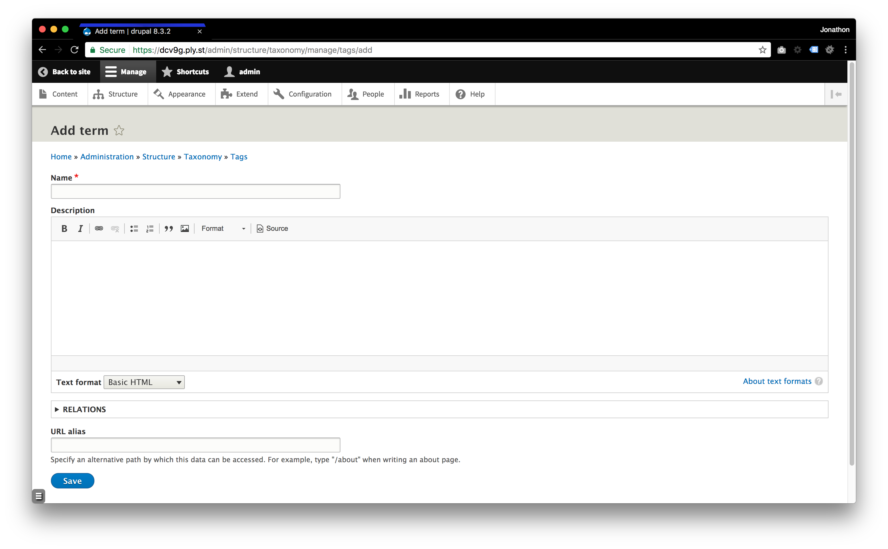
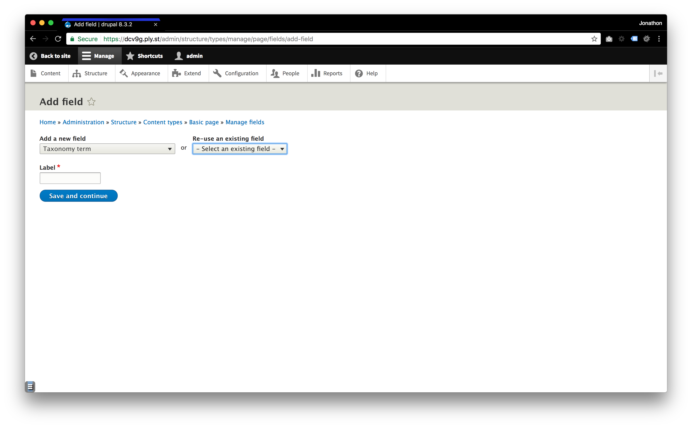
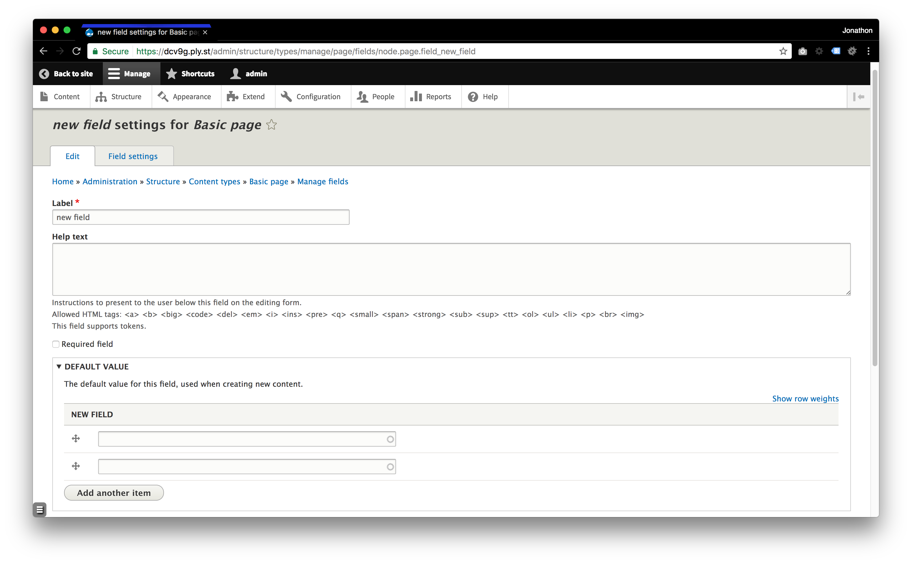
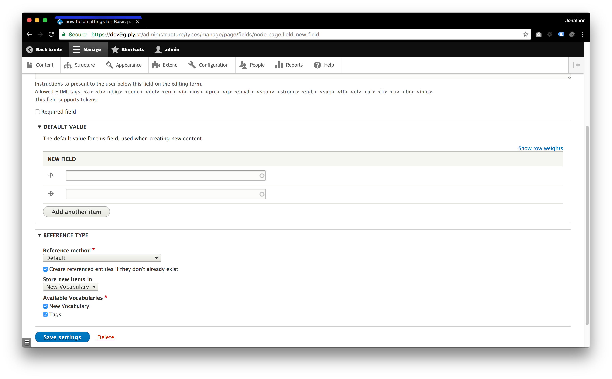

# Taxonomies

According to [Drupal.org - Taxonomy](https://www.drupal.org/docs/user_guide/en/structure-taxonomy.html):

> Taxonomy is used to classify website content. One common example of taxonomy is the tags used to classify or categorize posts in a blog website; the farmers market website could use an ingredients taxonomy to classify recipes. Individual taxonomy items are known as terms and a set of terms is known as a vocabulary

> Technically, taxonomy terms are an entity type and the entity subtypes are the vocabularies. Like other entities, taxonomy terms can have fields attached; for instance, you could set up an image field to contain an icon for each term.

> An individual vocabulary can organize its terms in a hierarchy, or it could be flat.

Taxonomy terms are normally attached as __reference fields__ to other content entities to provide categorization of content.

## Adding a New Vocabulary

To add a new vocabulary to your Taxonomy list:

Navigate to `Structure` -> `Taxonomy` -> `Add vocabulary`.

## Adding a Term Reference

1. Navigate to `Structure` -> `Content types` -> `Manage fields` -> `Add field`.
2. Pick `Taxonomy term` from the dropdown and provide a label.
3. Click `Save and Continue`.

4. Select the type of item to reference. `Taxonomy reference`.
5. Click `Save field settings`.
6. Fill out the necessary fields.

7. Click `Save settings`.

## Adding New Terms to Your Vocabulary

To add new terms to your Vocabulary:

Navigate to `Structure` -> `Taxonomy` -> `List terms` -> `Add term`.

### Free Tagging
> Allows new terms to be created right on the content editing form.

To enable the ability to add terms while editing content:
1. Navigate to `Structure` -> `Content types` -> `Manage fields`.
2. Click `Edit` for your Term Reference field.
3. Check `Create referenced entities if they don't already exist`.
4. Using the dropdown, choose the vocabulary your new terms will be saved to.

---

##### [Next Page >>](2.4-blocks.md)
