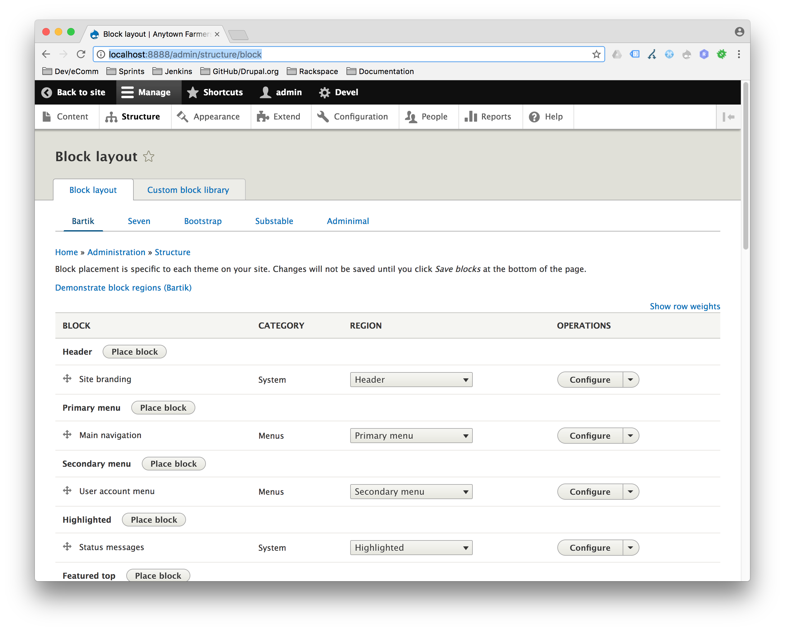
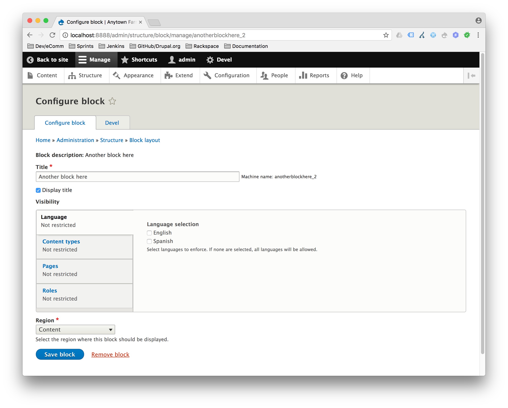
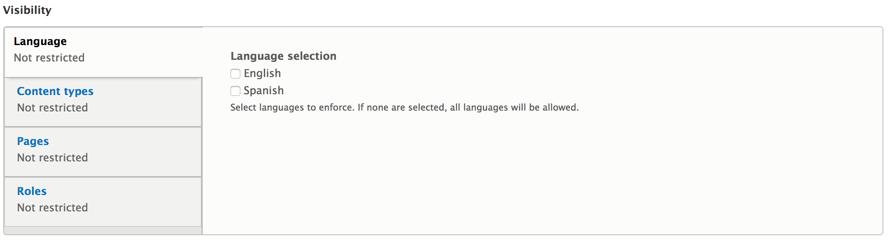
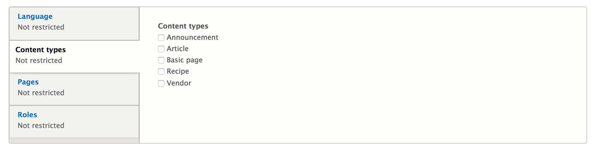
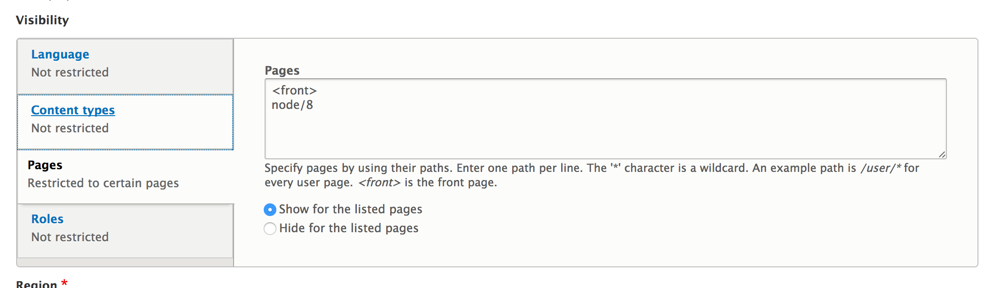
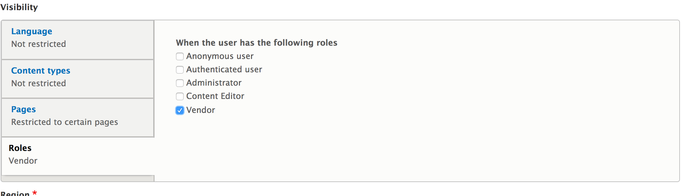
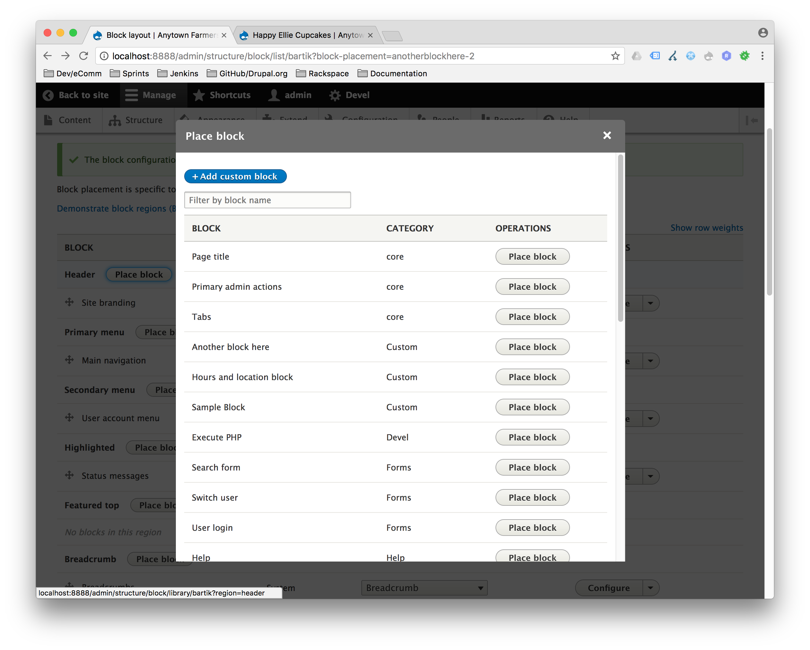

# Blocks

From [drupal.org - Concept: Blocks](https://www.drupal.org/docs/user_guide/en/block-concept.html):

> Blocks are individual pieces of your site’s web page layout. They are placed inside the regions of your theme, and can be created, removed, and rearranged in the Block layout (admin/structure/block) administration page. Examples of blocks include the Who’s online listing, the main navigation menu, and the breadcrumb trail. The main page content is also a block.
>
> Some modules make new blocks available for placement on your site. For example, when the core Search module is installed and configured, it provides a block that contains a search form. You may also create and place your own custom blocks.
>
> Each block has its own configuration settings, which allow you to select which pages of your site will display the block. It is even possible to place multiple copies of a block, each with its own separate configuration and visibility rules.

## Block Management

Blocks can be found at `Structure` -> `Block layout`.

You can configure a specific block by clicking the `Configure` button next to that block.

## Block Visibility

You can configure a blocks visibility settings (i.e. where they will and won't show up), based on:

1. Language (If [Multilingual](2.8-multilingual.md) is enabled)

   

2. Content Type

   

3. Page

   

4. User Role

   

## Block Placement

You can either place a specific block into a region by configuring the block, or by clicking the "Place block" button for a particular region on the `Block layout` page.

## Additional Resources

- [drupal.org - Concept: Blocks](https://www.drupal.org/docs/user_guide/en/block-concept.html):

---

##### [Next Page >>](2.5-menus.md)
