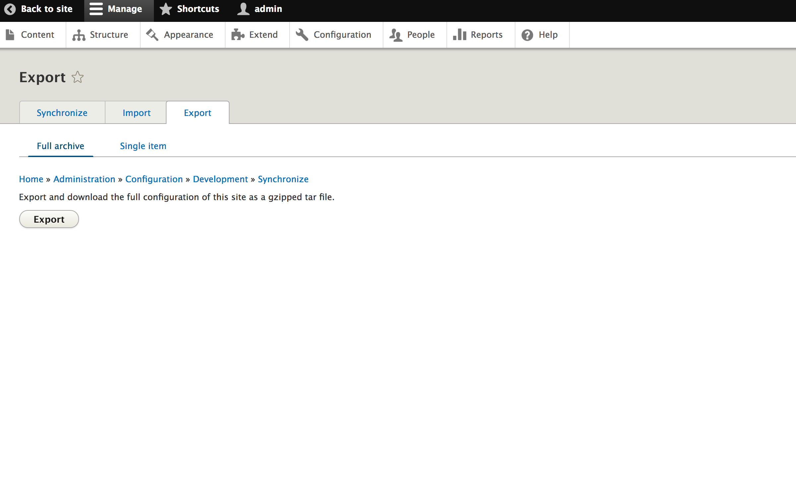
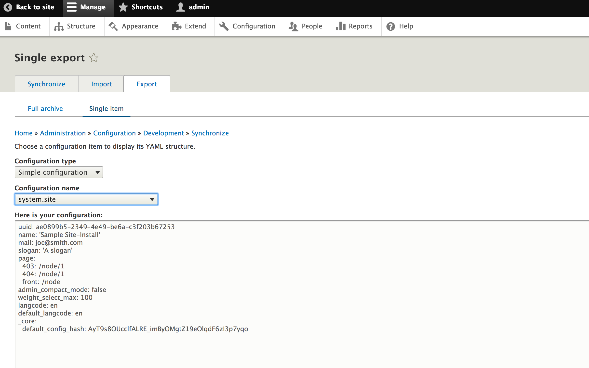
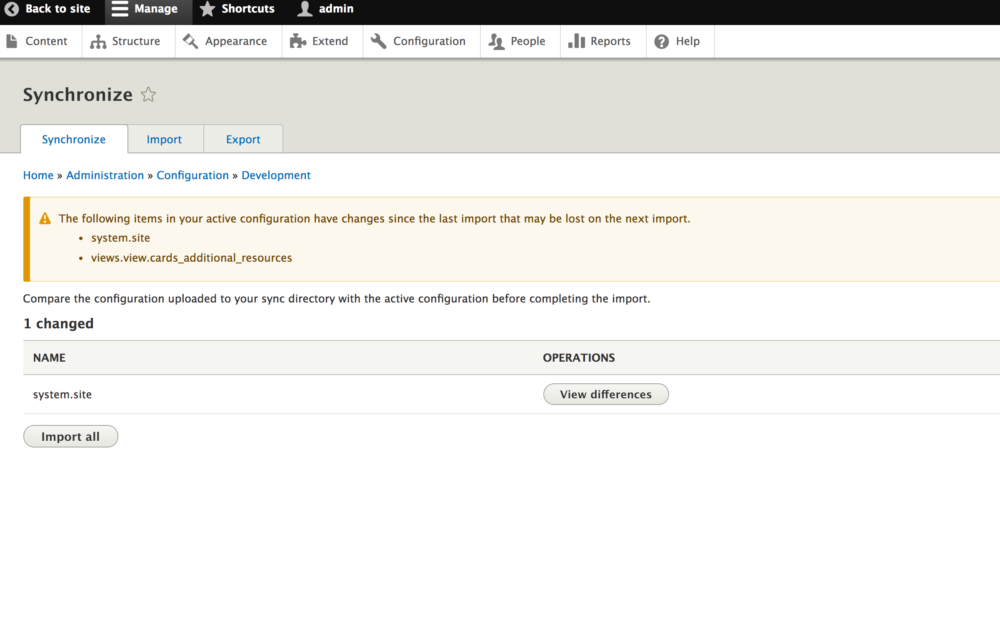
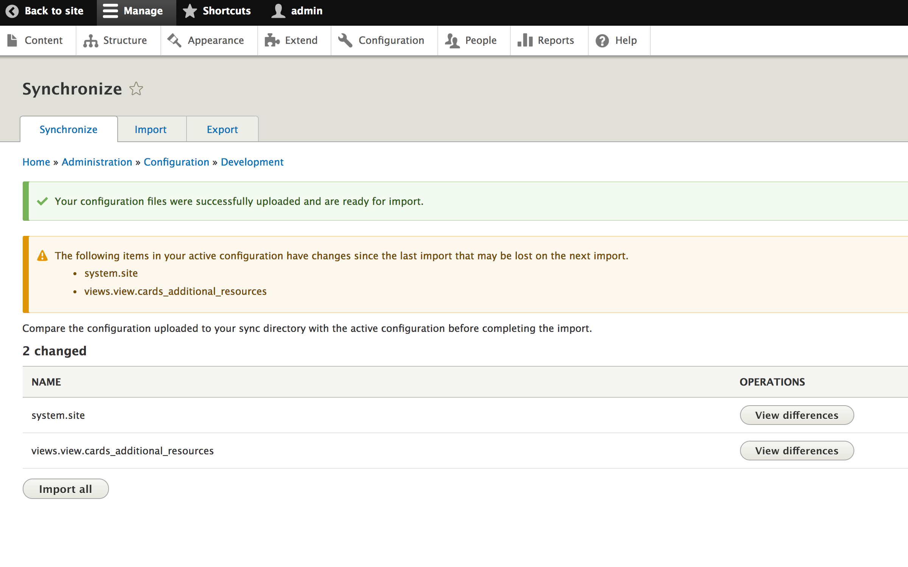

# Configuration Management

According to the [Drupal Configuration API Overview](https://www.drupal.org/docs/8/api/configuration-api/configuration-api-overview):

> The configuration API provides a central place for modules to store configuration data. This data can be simple configuration like your site name, or more complex information managed with configuration entities, such as views and content types.

> Configuration is a place to store information that you would want to synchronize from development to production. This information is often created during site building and is not typically generated by regular users during normal site operation.

Configuration management in D8 works similar to how Features module did in D7, but now ships out as part of core.

By default configuration data is stored in the `config` database table. The configuration management system built into core allows you to import and export these configuration settings across multiple environments and formats.

## Exporting Configurations

### Exporting Full Site Configurations
1. Make a configuration change to your system, such as the name of your site.
2. Navigate to `Configuration` -> `Development` -> `Configuration Synchronization` -> `Export`
3. Click `Export`

4. Your browser will download an exported file configuration tarball (e.g. `config-localhost-8888-2017-04-01-04-10.tar.gz`)

### Exporting Single Items
1. Make a configuration change to your system, such as the name of your site.
2. Navigate to `Configuration` -> `Development` -> `Configuration Synchronization` -> `Export` -> `Single item`
3. Select the type and name of the config item you wish to export.

4. You can now copy and paste this configuration elsewhere for future reference.

## Viewing Configuration Changes

1. Make a configuration change to your system for something that was previously exported, such as the name of your site.

2. Navigate to `Configuration` -> `Development` -> `Configuration Synchronization`


3. Click `View Differences`


- The `Active` column indicates the current setting in your site.
- The `Staged` column indicates the value from the previous exportation.

## Importing Configurations

### Importing Full Site Configurations
1. Obtain a previous export tarball (See [Exporting Full Site Configuration](#exporting-full-site-configuration) above)
2. Navigate to `Configuration` -> `Development` -> `Configuration Synchronization` -> `Import`
3. Click `Import`

4. After reviewing your changes, click `Import All`.


### Importing Single Items
1. Obtain YAML from a previous export.
2. Navigate to `Configuration` -> `Development` -> `Configuration Synchronization` -> `Import` -> `Single item`
3. Select the type and name of the config item you wish to import and press `Import`

4. Click `Confirm`


## Drush
View configuration settings using drush:
```shell
drush config-get system.site
drush config-get system.site name
drush config-get system.site mail
# or
drush cget system.site
drush cget system.site name
drush cget system.site mail
```

Set configuration settings using drush:
```shell
drush config-set system.site name 'My Company Website'
drush config-set system.site mail 'joe.rodgers@mycompany.com'
# or
drush cset system.site name 'My Company Website'
drush cset system.site mail 'joe.rodgers@mycompany.com'
```

To export configurations using drush:
```shell
drush config-export
# or
drush cex
```
^ This is similar regenerating features in D7.

To import configurations using drush:
```shell
drush config-import
# or
drush cim
```
^ This is similar to reverting features in D7.

## Configuration Storage

You can alter the storage location of your configuration in your `settings.php` file (or comparable file in your system):
```php
<?php
/**
 * Location of the site configuration files.
 *
 * The $config_directories array specifies the location of file system
 * directories used for configuration data. On install, the "sync" directory is
 * created. This is used for configuration imports. The "active" directory is
 * not created by default since the default storage for active configuration is
 * the database rather than the file system. (This can be changed. See "Active
 * configuration settings" below).
 *
 * The default location for the "sync" directory is inside a randomly-named
 * directory in the public files path. The setting below allows you to override
 * the "sync" location.
 *
 * If you use files for the "active" configuration, you can tell the
 * Configuration system where this directory is located by adding an entry with
 * array key CONFIG_ACTIVE_DIRECTORY.
 *
 * Example:
 * @code
 *   $config_directories = array(
 *     CONFIG_SYNC_DIRECTORY => '/directory/outside/webroot',
 *   );
 * @endcode
 */
```

## Additional Resources:
- [d8cards.com : Day 01 - Configuration Management in D8](http://www.d8cards.com/sites/default/files/2016-05/Day%2001%20-%20Configuration%20Management%20in%20D8-rev05132016.pdf)
- [drupal.org - Configuration Management](https://www.drupal.org/docs/8/configuration-management)
- [drupal.org - Configuration API Overview](https://www.drupal.org/docs/8/api/configuration-api/configuration-api-overview)
- [drush config](https://drushcommands.com/drush-8x/config/)

---

##### [Next Page >>](2.8-multilingual.md)
