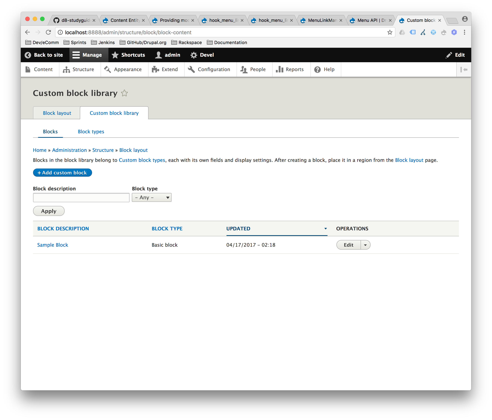
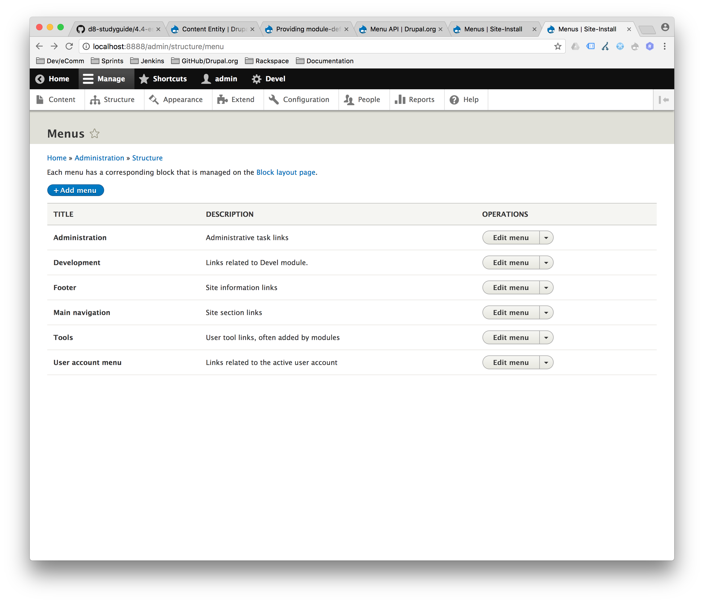
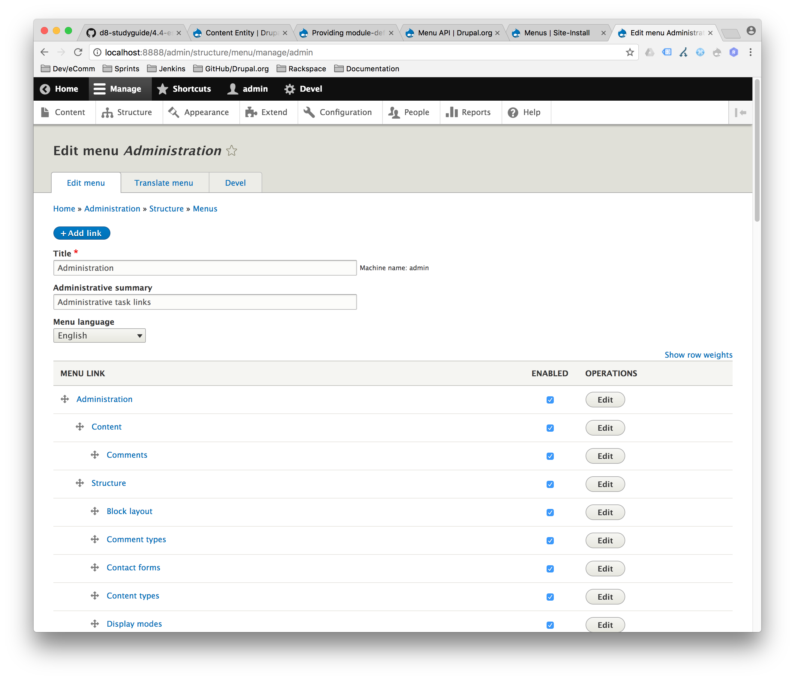

# Menu API

## Module-defined menu links

You can define menu links in `modulename.links.menu.yml`:

```
example.admin:
  title: 'Example settings'
  description: 'Manage example settings for your site'
  parent: system.admin_config_development
  route_name: example.admin
  weight: 100
  route_parameters: { key: 'value' }
  #If menu_name is omitted, the "Tools" menu will be used.
  menu_name: devel
  options:
    attributes:
      target: _blank
```

Additionally, `hook_menu_links_discovered_alter()` can be used to dynamically generate new and alter existing links.

## Local tasks

Local tasks are what generate the tabs on top of pages.

You can define static tasks by specifying in `modulename.links.task.yml`:

For example, the `block_content` module defines the following local tasks:
```
entity.block_content.collection:
  title: 'Custom block library'
  route_name: entity.block_content.collection
  base_route: block.admin_display
block_content.list_sub:
  title: Blocks
  route_name: entity.block_content.collection
  parent_id: entity.block_content.collection
entity.block_content_type.collection:
  title: Block types
  route_name: entity.block_content_type.collection
  parent_id: entity.block_content.collection
  weight: 1
```

The above code adds the `Custom block library` tab as a top-level tab, and `Blocks` and `Block types` as sub-navigation to the `Custom block library` tab.



## Local actions

Actions define operations to add to the admin panel.

You can define static actions using `modulename.links.action.yml`.

For example, the `menu_ui` module defines the following actions:
```
entity.menu.add_link_form:
  route_name: entity.menu.add_link_form
  title: 'Add link'
  class: \Drupal\menu_ui\Plugin\Menu\LocalAction\MenuLinkAdd
  appears_on:
    - entity.menu.edit_form

entity.menu.add_form:
  route_name: entity.menu.add_form
  title: 'Add menu'
  appears_on:
    - entity.menu.collection
```

The above code adds an `Add menu` button to the menu page and an `Add link` button to the drop-down button for the individual menus.



## Contextual links

Contextual links provide contextual operations to users on the frontend.

You can define contextual links using `modulename.links.contextual.yml`.

For example, the `blocks` module defines the following contextual links:
```
block_configure:
  title: 'Configure block'
  route_name: 'entity.block.edit_form'
  group: 'block'
```

The above code adds a `Configure block` contextual link to the `block` group. When a block is rendered for a user that has the appropriate permissions, a contextual link is displayed.


Contextual links are rendered when they are included in a render array. (See: [Render API](4.4-essential-apis-render.md)).

For example, the `BlockViewBuilder` adds this to the render array:
```php
<?php
protected static function buildPreRenderableBlock($entity, ModuleHandlerInterface $module_handler) {
  // ...
  // All blocks get a "Configure block" contextual link.
  '#contextual_links' => [
    'block' => [
      'route_parameters' => ['block' => $entity->id()],
    ],
  ],
  // ...
}
?>
```

In the above example `'block'` refers to the contextual link group called `'block'`.

Additionally, `hook_contextual_links_view_alter()` can be used to dynamically generate new and alter existing contextual links.

## Additional Resources
- [Menu API](https://www.drupal.org/docs/8/api/menu-api)

---

##### [Next Page >>](4.4-essential-apis-render.md)
