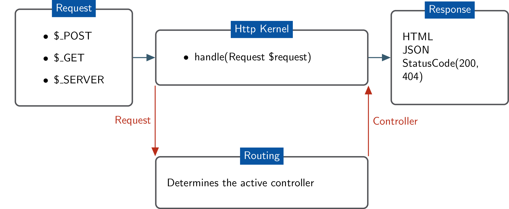

# Routing System

From [Routing System Overview](https://www.drupal.org/docs/8/api/routing-system/routing-system-overview):
> Drupal 8's routing system is heavily based on Symfony's. Drupal's routing system can do everything Symfony's can (and more), and both use the same syntax to define routes.
>
> A route is a path which is defined for Drupal to return some sort of content on. For example, the default front page, '/node' is a route. When Drupal receives a request, it tries to match the requested path to a route it knows about. If the route is found, then the route's definition is used to return content. Otherwise, Drupal returns a 404.
>
> 
>
> The routing system is responsible for matching paths to controllers, and you define those relations in routes. You can pass on additional information to your controllers in the route. Access checking is integrated as well.

## routing.yml files

A module would defines routing rules in `module_name.routing.yml`.

Here is an example route:
```
example.content:
  path: '/example'
  defaults:
    _controller: '\Drupal\example\Controller\ExampleController::content'
    _title: 'Hello World'
  requirements:
    _permission: 'access content'
```

Then you could define a controller like this:

```php
<?php
namespace Drupal\example\Controller;

use Drupal\Core\Controller\ControllerBase;

/**
 * An example controller.
 */
class ExampleController extends ControllerBase {

  /**
   * {@inheritdoc}
   */
  public function content() {
    $build = array(
      '#type' => 'markup',
      '#markup' => t('Hello World!'),
    );
    return $build;
  }

}
?>
```

Any default value that does not begin with an underscore can get passed to
the `content()` function.

```
example.content:
  path: '/example'
  defaults:
    _controller: '\Drupal\example\Controller\ExampleController::content'
    _title: 'Hello World'
    some_var: 15
    another_var: 'This is a string'
  requirements:
    _permission: 'access content'
```

```php
<?php
// ...
public function content(Request $request, $some_var, $another_var) {
  // $some_var will have value 15
  // $another_var will have value 'This is a string'
}
?>
```

You can also parameterize routes.  For example:

```
example.name:
  path: '/example/{name}'
  defaults:
    _controller: '\Drupal\example\Controller\ExampleController::content'
  requirements:
    _permission: 'access content'
```

```php
<?php
class ExampleController {  
  // ...
  public function content($name) {
    // Name is a string value.
    // Do something with $name.
  }
}
?>
```

You can also upcast route parameters using placeholders. For example:

```
example.name:
  path: '/example/{node}'
  defaults:
    _controller: '\Drupal\example\Controller\ExampleController::content'
  requirements:
    _permission: 'access content'
```

Now suppose we have a node with nid 3, and someone navigations to `/example/3`.

As an example, here's how we can pass in the entire node object with nid 3, and not just the nid value, and use that object in our controller.

We can update our routing.yml file to add an explicit definition for our parameter:

```
example.name:
  path: '/example/{a_node}'
  defaults:
    _controller: '\Drupal\example\Controller\ExampleController::content'
  requirements:
    _permission: 'access content'
  options:
    parameters:
      a_node:
        type: a_node
```

Then in `my_module.services.yml`:
```
services:
  a_node:
    class: Drupal\example\ParamConverter\ExampleParamConverter
    tags:
      - { name: paramconverter }
```

And finally creating `src/ParamConverter/ExampleParamConverter.php`:
```php
<?php

namespace Drupal\example\ParamConverter;

use Drupal\Core\ParamConverter\ParamConverterInterface;
use Drupal\node\Entity\Node;
use Symfony\Component\Routing\Route;

class ExampleParamConverter implements ParamConverterInterface {
  public function convert($value, $definition, $name, array $defaults) {
    return Node::load($value);
  }

  public function applies($definition, $name, Route $route) {
    return (!empty($definition['type']) && $definition['type'] == 'a_node');
  }

}

?>
```

Now inside your controller you will have access to an instantiated $a_node object:

```
<?php

namespace Drupal\example\Controller;

use Drupal\Core\Controller\ControllerBase;
use Drupal\node\NodeInterface;
use Symfony\Component\DependencyInjection\ContainerInterface;

/**
 * Class ExampleController.
 *
 * @package Drupal\example_module\Controller
 */
class ExampleController extends ControllerBase {
  /**
   * Hello.
   *
   * @return string
   *   Return Hello string.
   */
  public function content($name = "undefined", NodeInterface $a_node = NULL) {
    return [
      '#type' => 'markup',
      '#markup' => $this->t('Node passed title: ' . $a_node->getTitle()),
    ];
  }

}

```

## Additional Resources
- [drupal.org: Routing System Overview](https://www.drupal.org/docs/8/api/routing-system/routing-system-overview)

---

##### [Next Page >>](4.4-essential-apis-configuration.md)
