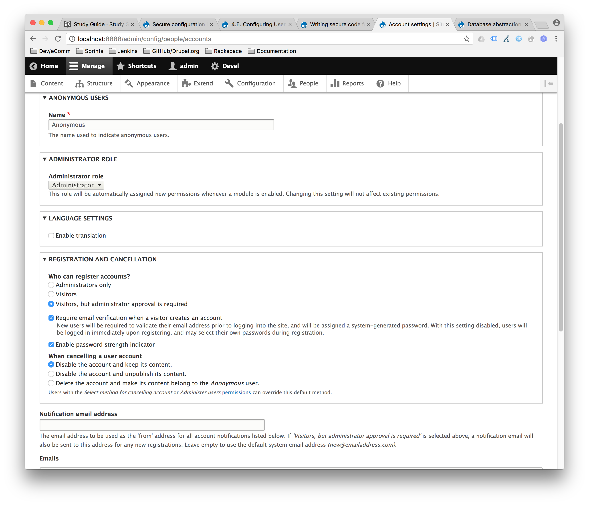
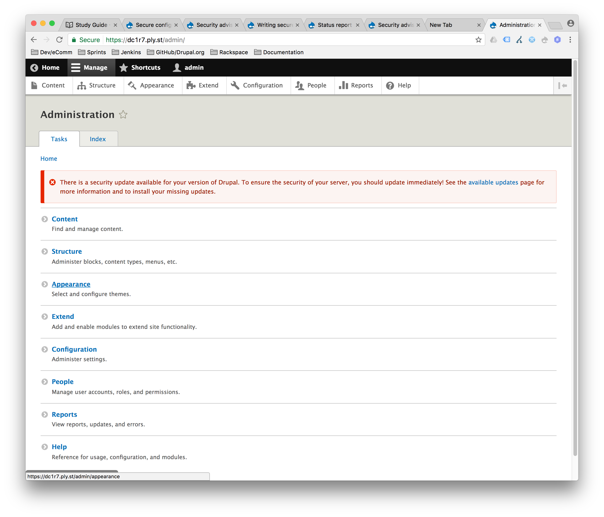

# Security

Web application security is an ever-growing concern and Drupal is no exception
to that. The [Drupal Security Team](https://www.drupal.org/drupal-security-team/)
has laid out these goals to help keep Drupal secure:

- Resolve reported security issues in a Security Advisory
- Provide assistance for contributed module maintainers in resolving security issues
- Provide documentation on how to write secure code
- Provide documentation on securing your site
- Help the infrastructure team to keep the drupal.org infrastructure secure

There are many number of things you can do at the server-level, in your
Drupal configuration and programmatically that will help keep your site secure.
Here are some good practices for keeping a Drupal site secure.  This is by no
means an all-inclusive list, and shouldn't be relied on as your sole source of
Drupal security expertise, as it's merely meant to be a guide for potential topics
on the Acquia Drupal 8 certification exam.

## Sanitizing Input

If someone, authorized or not, has the ability to enter data into Drupal via
form, query parameters, APIs, RSS feed or any other mechanism, special care
needs to be taken in handling, processing and outputting that input.

### Using Twig Autoescape

[Drupal enables Twig's autoescape features by default](https://www.drupal.org/node/1825952).
This helps prevent XSS attacks by automatically escaping HTML.

Here are a few examples:

---

```twig

{{ bad_input }}
```
This yields the following escaped HTML:

```html
My input &lt;img src=&quot;https://media.giphy.com/media/YU0j0j92jLdU4/giphy.gif&quot;&gt; has an image
```

---

If you are certain that the data you are outputting is safe, you can do so by piping the data into the `raw` filter:

```twig

{{ safe_input|raw }}
```
This yields the following unescaped HTML:

```html
My input has an image and I trust it: 
```

---

Twig doesn't escape static expressions:

```twig
{{ 'There is no escape<br>' }}
```
This yields the following unescaped HTML:

```html
There is no escape<br>
```

---

You can also use the `safe_join` filter to safely output an array of items.

For example:
```twig

{{ items|safe_join('<hr>') }}
```
This yields the following escaped HTML:
```html
good input<hr>&lt;strong&gt;bad input&lt;/strong&gt;
```

---

You should never directly pass a variable directly into the `t` filter:

```twig

{{ bad_input|t }}
```
This yields the following unescaped HTML:
```html
My input  has an image
```

### API functions

- Use `Html::escape($string)` to programmatically escape all HTML.
- Use `Xss::filter($string, $html_tags)` to allow some HTML tags, where `$html_tags` is
an array of allowed tags (e.g. `$html_tags = ['a', 'strong', 'p'];`)
- Use `Xss::filterAdmin($string)` for admin-only functionality. Allows all HTML except
styles and scripts.
- Use `UrlHelper::stripDangerousProtocols($uri)` to strip dangerous protocols off
of a URL such as `javascript:`
- Use `UrlHelper::filterBadProtocol($uri)` to strip dangerous protocols off of
a URL such as `javascript:` and escape any HTML.

### Database Abstraction

The way you write database queries in Drupal is very important. Take a look at a few
examples from [Writing secure code for Drupal 8](https://www.drupal.org/docs/8/security/writing-secure-code-for-drupal-8):

---

This is a great example of what you should never do:

```php
<?php
db_query('SELECT foo FROM {table} t WHERE t.name = '. $_GET['user']);
?>
```

In the above code example, `$_GET['user']` can contain anything as it is,
passed in from a standard GET http request, opening the door for bad actors to
execute other SQL commmands. This is known as a SQL Injection attack.

---

`db_query()` does provide some facilities to protect against this, using prepared statements:
```php
<?php
db_query("SELECT foo FROM {table} t WHERE t.name = :name", [':name' => $_GET['user']]);
?>
```

---

All that said, use of `db_query()` is deprecated in Drupal 8 and will be removed
in Drupal 9. Instead you should use the [database abstraction layer](https://api.drupal.org/api/drupal/core%21lib%21Drupal%21Core%21Database%21database.api.php/group/database/8.2.x)
to assemble database queries. For example:

```php
<?php
$query = \Drupal::database()->select('table', 't');
$query->fields('t', ['foo', 'bar', 'baz']);
$query->condition('t.foo', '13');
$query->range(0, 1);
$row = $query->execute()->fetchAssoc();
?>
```

## Generated \*.php files

From [Security of generated PHP files](https://www.drupal.org/docs/8/security/security-of-generated-php-files):
> Drupal 8 heavily relies on generated PHP files. This obviously raises security concerns: if an attacker can alter or add to them, arbitrary PHP code might be run. Not just by reaching the generated PHP file via a web browser but also by Drupal including it.

> Drupal 8 offers several solutions to this problem: it is possible to generate PHP files in a staging environment and on production use a read only storage class. Also, the default storage class uses a special file name for the dumped code. This file name is a hash from a secret and the containing directory modification time. On read, it also checks that the file modification time is not larger than the directory modification time. These combined mean that although the default storage permissions lets anyone write the compiled files when they are opened and written, the hash immediately becomes invalid. Similarly with deleting the file and writing a new file under the same name. The secret is stored together with the database credentials in settings.php so if the attacker can learn that secret the site is already compromised.

## File Permissions

You may wish to change the owner permission to a different user than your web
server runs as. For example, assuming your web server runs as user `www-data`,
you could do something like this:
```bash
sudo chown -R MYUSER:www-data *
sudo find . -type d -exec chmod 755 {} \;
sudo find . -type f -exec chmod 640 {} \;
sudo find sites/default/files/config* -type f -exec chmod 664 {} \;
```

This only allows `MYUSER` to make changes to any files or directory outside of
the `sites/default/files/config` directory.

The [Security Review Module](https://www.drupal.org/project/security_review) can
be used to check your site's permissions.

## Configuration

From [Secure Configuration for Site Builders](https://www.drupal.org/docs/8/security/secure-configuration-for-site-builders):
> When Drupal is first installed, a lot of its configuration is geared towards ease of use for certain use cases: for example, a community-led website, that needs authenticated contributions of some sort, will need to permit site visitors to create their own (low-privilege) accounts. However, you might want to limit the number of accounts on your website, and therefore to turn that off.

### Prevent users from creating their own accounts

`Configuration` -> `People` -> `Account Settings` -> `Registration and Cancellation`


Change the `Who can register accounts?` setting to `Administrators only`.

This, as well as other user-related settings, can also be changed in the
`user.settings` config by setting `register` to `admin_only`.

For example:

```
anonymous: Anonymous
verify_mail: true
notify:
  cancel_confirm: true
  password_reset: true
  status_activated: true
  status_blocked: false
  status_canceled: false
  register_admin_created: true
  register_no_approval_required: true
  register_pending_approval: true
register: admin_only
cancel_method: user_cancel_block
password_reset_timeout: 86400
password_strength: true
langcode: en
```

### Secure user with `uid`=1

The user with `uid`=1 has special privileges. There are a few different ways to
manage this:

- Don't name the default user `admin`. Use something a bit more obscure and hard
for a person, or robot, to guess.
- Disable the user entirely. This can be done via drush: `drush user-block 1` or
directly in the database `UPDATE users_field_data SET status = 0 WHERE uid = 1`
- Use long, randomly generated passwords and store the password somewhere
safely.
- Use the [Alert to Administrator](https://www.drupal.org/project/alert_to_admin)
module to remind users they are logged in as a site administrator to make
changes carefully.

### Role permissions

Make use of Drupal's role system located at `People` -> `Roles`.


Create whatever roles you need and then click `Edit Permissions` for that particular role. Then check off the
necessary permissions for that particular role.


Roles can also be managed in the config. For example:
```
uuid: 581ef94b-2c8b-4c32-97cb-883675794243
langcode: en
status: true
dependencies: {  }
id: content_editor
label: 'Content Editor'
weight: 3
is_admin: null
permissions:
  - 'create content translations'
  - 'delete content translations'
  - 'create announcement content'
  - 'delete own announcement content'
  - 'edit any announcement content'
  - 'edit own announcement content'
  - 'create article content'
  - 'delete own article content'
  - 'edit any article content'
  - 'edit own article content'
```

## Keeping your site up-to-date

From time to time, security vulnerabilities within Drupal Core and Contrib modules
and themes are uncovered. As a result, it is important to keep your site as
up-to-date as possible.

If you have the `Update Manager` module enabled, Drupal will very politely let
you know when there is a security update in the admin panel:


Additionally, you can find all security related updates on the
[Security Advisories](https://www.drupal.org/security) page. You can subscribe
to Security Advisory mailing lists and rss feeds for immediate notification.

## Other Security Tips
- Use [Secure Login](https://www.drupal.org/project/securelogin) module to force
all logins to happen on `https://`.
- Prevent execution of untrusted PHP.
- Disable access to old user accounts.
- Disable access to /admin/ outside of trusted networks.
- Use intrusion detection systems, and rootkit and vulnerability scanners regularly
to stay on top of what is happening in your system.

## Additional Resources

- [drupal.org: Security in Drupal 8](https://www.drupal.org/docs/8/security)
- [drupal.org: Writing secure code for Drupal 8](https://www.drupal.org/docs/8/security/writing-secure-code-for-drupal-8)
- [drupal.org: Security of generated PHP files](https://www.drupal.org/docs/8/security/security-of-generated-php-files)
- [drupal.org: Secure configuration for site builders](https://www.drupal.org/docs/8/security/secure-configuration-for-site-builders)
- [drupal.org: Drupal security team](https://www.drupal.org/drupal-security-team/)
